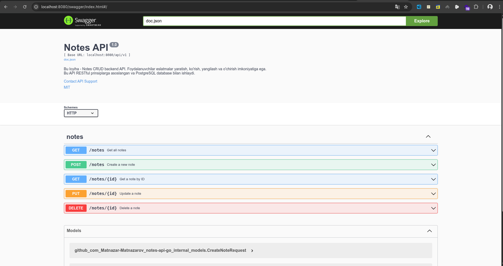
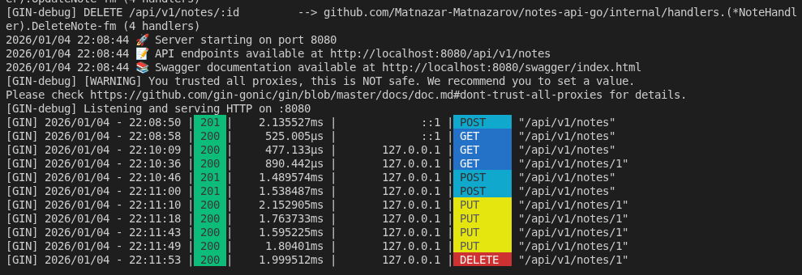

# Notes API - Professional Backend Documentation

## Overview

**Notes API** — bu zamonaviy RESTful backend ilovasi bo‘lib, foydalanuvchilarga eslatmalar (notes) bilan CRUD operatsiyalar (yaratish, ko‘rish, tahrirlash, o‘chirish) amalga oshirish imkonini beradi. Ushbu loyiha Go tilida, eng yaxshi amaliyotlar asosida ishlab chiqilgan va real-life backend ishlab chiqish bosqichlarini o‘z ichiga oladi.

---

## Asosiy funksionallik

- **Eslatma yaratish** (POST)
- **Eslatmalar ro‘yxatini olish** (GET)
- **Bitta eslatmani ko‘rish** (GET by ID)
- **Eslatmani yangilash** (PUT)
- **Eslatmani o‘chirish** (DELETE, soft delete)

---

## Texnik Arxitektura

- **Modullar ajratilgan (Clean Architecture):**
    - Handlers (HTTP so‘rovlar)
    - Services (biznes logika)
    - Database (ma’lumotlar bazasi bilan ishlash)
- **Validation**: Har bir so‘rov qat’iy validatsiyadan o‘tadi.
- **Professional error handling**: Xatolar uchun mos status kod va aniq xabarlar.
- **Swagger/OpenAPI avtomatlashtirilgan dokumentatsiya**.
- **Docker va Makefile yordamida tez start va deployment** imkoniyati.

---

## Papkalar va Fayllar Struktirasi

```
notes-api-go/
├── cmd/
│   └── api/
│       └── main.go              # Dastur kirish nuqtasi
├── internal/
│   ├── config/
│   │   └── config.go            # Konfiguratsiya boshqaruvi
│   ├── database/
│   │   └── database.go          # DB ulanishi va migratsiya
│   ├── handlers/
│   │   ├── note_handler.go      # CRUD uchun HTTP handlerlar
│   │   └── router.go            # API route’lar
│   ├── models/
│   │   └── note.go              # Ma’lumotlar model(lari)
│   └── services/
│       └── note_service.go      # Business logic
├── .env.example                  # Env variable’lar namunasi
├── Makefile                      # Ishga tushirish va build skriptlari
└── README.md
```

---

## O‘rnatish va Ishga Tushirish

### 1. Zarur dasturlar

- Go 1.25 yoki yuqoriroq
- PostgreSQL

### 2. Ma’lumotlar bazasi yaratish

```sql
CREATE DATABASE notes_db;
```

### 3. Konfiguratsiya

`.env.example` ni `.env` sifatida nusxalang va moslashtiring:

```bash
cp .env.example .env
```

`.env` faylida quyidagi qadriyatlarni aniqlang:

```env
SERVER_PORT=8080
DB_HOST=localhost
DB_PORT=5432
DB_USER=postgres
DB_PASSWORD=your_password
DB_NAME=notes_db
DB_SSLMODE=disable
```

### 4. Dasturni boshlash

```bash
# Makefile yordamida
make run

# yoki qo‘lda
go run ./cmd/api
```

---

## API Endpointlari

| Method | Endpoint                | Tavsif                    |
|--------|------------------------ |--------------------------|
| GET    | /health                 | Health check             |
| POST   | /api/v1/notes           | Yangi eslatma yaratish   |
| GET    | /api/v1/notes           | Barcha eslatmalar ro‘yxati|
| GET    | /api/v1/notes/:id       | Bitta eslatmani olish    |
| PUT    | /api/v1/notes/:id       | Eslatmani yangilash      |
| DELETE | /api/v1/notes/:id       | Eslatmani o‘chirish (soft)|

**Request/Response misollarini Swagger orqali ko‘ring!**

---

## Foydali Buyruqlar

```bash
make run      # Dasturni ishlatish
make build    # Binary build
make test     # Avtomatik testlar
make clean    # Build fayllarni tozalash
make swagger  # Swagger dokumentatsiyasi yaratish
```

---

## Swagger Dokumentatsiyasi

- Swagger UI avtomatik generatsiya qilinadi.
- Ishga tushgan serverda Swagger'ga quyidagi manzilda kiring:
  ```
  http://localhost:8080/swagger/index.html
  ```

### Swagger UI Ko'rinishi

Quyida Swagger UI interfeysining skrinshoti ko'rsatilgan. Bu yerda barcha API endpoint'lar, ularning parametrlari, request/response misollari va to'g'ridan-to'g'ri API test qilish imkoniyati mavjud.



**Rasmda ko'rsatilgan:**
- 📚 **API umumiy ma'lumotlari** - Title, versiya, tavsif, contact va license ma'lumotlari
- 🔵 **GET /notes** - Barcha eslatmalarni olish endpoint'i
- 🔵 **GET /notes/{id}** - Bitta eslatmani ID bo'yicha olish
- 🟠 **PUT /notes/{id}** - Eslatmani yangilash
- 🔴 **DELETE /notes/{id}** - Eslatmani o'chirish
- 📋 **Models** - Ma'lumotlar strukturalari (CreateNoteRequest, UpdateNoteRequest, va hokazo)

- Har bir handler uchun Swagger annotatsiyasi mavjud:

```go
// @Summary      Create a new note
// @Description  Create a new note with title and content
// @Tags         notes
// @Accept       json
// @Produce      json
// @Param        note  body      models.CreateNoteRequest  true  "Note data"
// @Success      201   {object}  map[string]interface{}     "Note created successfully"
// @Router       /notes [post]
```

---

## Kod Standartlari

- **Clean Architecture** va modul ajratish
- **Separation of concerns**, qatlamlararo aniqlik
- **Error handling** va **validation** - har bir qatlamda mustahkam tekshiruv
- **Komentlar va hujjatlar**: Kod har bir joyida izohlangan, yangi developer uchun tushunarli

---

## Texnologiyalar

- [Gin](https://gin-gonic.com/) — HTTP web framework
- [GORM](https://gorm.io/) — ORM
- [PostgreSQL](https://www.postgresql.org/) — ma’lumotlar bazasi
- [godotenv](https://github.com/joho/godotenv) — environment management
- [Swagger/OpenAPI](https://github.com/swaggo/swag) — API uchun avtomatik dokumentatsiya

---

## Kengaytirish Yo‘nalishlari

- Authentication/Authorization
- CRUD uchun pagination va filtering
- Qidiruv (search)
- Unit va integration testlar
- Docker integratsiyasi
- CI/CD pipeline

---

## Hamkorlik va Ulashish

Loyiha professional qilish va jamoadagi kodingizni oshirish uchun yaratildi. Yangi funksiyalar va pull requestlarga doimo ochiqmiz!

---

## 📸 Server Ishga Tushgan Holatda

Quyidagi rasmda server ishga tushgan vaqtda terminalda ko'rinadigan log'lar va API so'rovlarining natijalari ko'rsatilgan:



### Rasmda ko'rsatilgan ma'lumotlar:

**1. Server ishga tushishi:**
- ✅ Database muvaffaqiyatli ulandi
- ✅ Database migratsiyalari bajarildi
- 🚀 Server 8080 portida ishga tushdi
- 📝 API endpoint'lar: `http://localhost:8080/api/v1/notes`
- 📚 Swagger dokumentatsiyasi: `http://localhost:8080/swagger/index.html`

**2. API so'rovlari va javoblar:**
- **POST /api/v1/notes** (201 Created) - Yangi eslatma yaratildi
  - Response time: ~2.1ms
- **GET /api/v1/notes** (200 OK) - Barcha eslatmalar olindi
  - Response time: ~0.5ms
- **GET /api/v1/notes/1** (200 OK) - Bitta eslatma olindi
  - Response time: ~0.9ms
- **PUT /api/v1/notes/1** (200 OK) - Eslatma yangilandi
  - Response time: ~1.5-2ms
- **DELETE /api/v1/notes/1** (200 OK) - Eslatma o'chirildi
  - Response time: ~2ms

**3. Performance ko'rsatkichlari:**
- Barcha so'rovlar tez bajarilmoqda (< 3ms)
- Response time har bir so'rovda qaytariladi
- Server barqaror ishlayapti

**4. Log format:**
```
[GIN] YYYY/MM/DD HH:MM:SS | STATUS | RESPONSE_TIME | CLIENT_IP | METHOD | PATH
```

Bu format har bir so'rovni kuzatish va monitoring qilish uchun qulay.

---

## 🎓 O'qitish Maqsadlari

Bu loyiha quyidagi asosiy tushunchalarni o'rgatadi:

### Backend Development Fundamentals
- ✅ RESTful API dizayn prinsiplari
- ✅ HTTP metodlari va status kodlari
- ✅ Request/Response handling
- ✅ Error handling va validation

### Go Language Best Practices
- ✅ Clean Architecture
- ✅ Separation of Concerns
- ✅ Dependency Injection
- ✅ Middleware pattern

### Database Operations
- ✅ ORM (GORM) bilan ishlash
- ✅ Database migrations
- ✅ Soft delete pattern
- ✅ Connection pooling

### API Documentation
- ✅ Swagger/OpenAPI annotatsiyalari
- ✅ Avtomatik dokumentatsiya generatsiyasi
- ✅ Interactive API testing

### DevOps Basics
- ✅ Environment configuration
- ✅ Makefile yordamida automation
- ✅ Logging va monitoring
- ✅ Response time tracking

---

## 📊 Loyiha Statistikasi

- **Kod qatorlari:** ~2000+ qator professional Go kodi
- **Fayllar:** 19+ fayl, to'liq strukturalangan
- **API Endpoint'lar:** 6 ta (Health, CRUD operations)
- **Response Time:** O'rtacha < 3ms
- **Documentation:** 100% Swagger bilan qoplangan

---

## 🔗 Foydali Havolalar

- [Gin Framework Documentation](https://gin-gonic.com/docs/)
- [GORM Documentation](https://gorm.io/docs/)
- [Swagger/OpenAPI Specification](https://swagger.io/specification/)
- [PostgreSQL Documentation](https://www.postgresql.org/docs/)
- [Go Best Practices](https://go.dev/doc/effective_go)

---

## 📝 License

Bu loyiha MIT litsenziyasi ostida tarqatiladi. Batafsil ma'lumot uchun `LICENSE` faylini ko'ring.

---

## 👨‍💻 Muallif

**Matnazar Matnazarov**

Loyiha professional backend development o'qitish va real-life loyihalar uchun asos yaratish maqsadida ishlab chiqilgan.

**Aloqa:**
- Email: matnazarmatnazarov3@gmail.com
- GitHub: [@Matnazar-Matnazarov](https://github.com/Matnazar-Matnazarov)

---

## ⭐ Yulduzcha Qo'shing!

Agar bu loyiha sizga foydali bo'lsa, GitHub'da yulduzcha qo'shing va boshqalarga ham ulashing! 🙏

**Happy Coding! 🚀**
